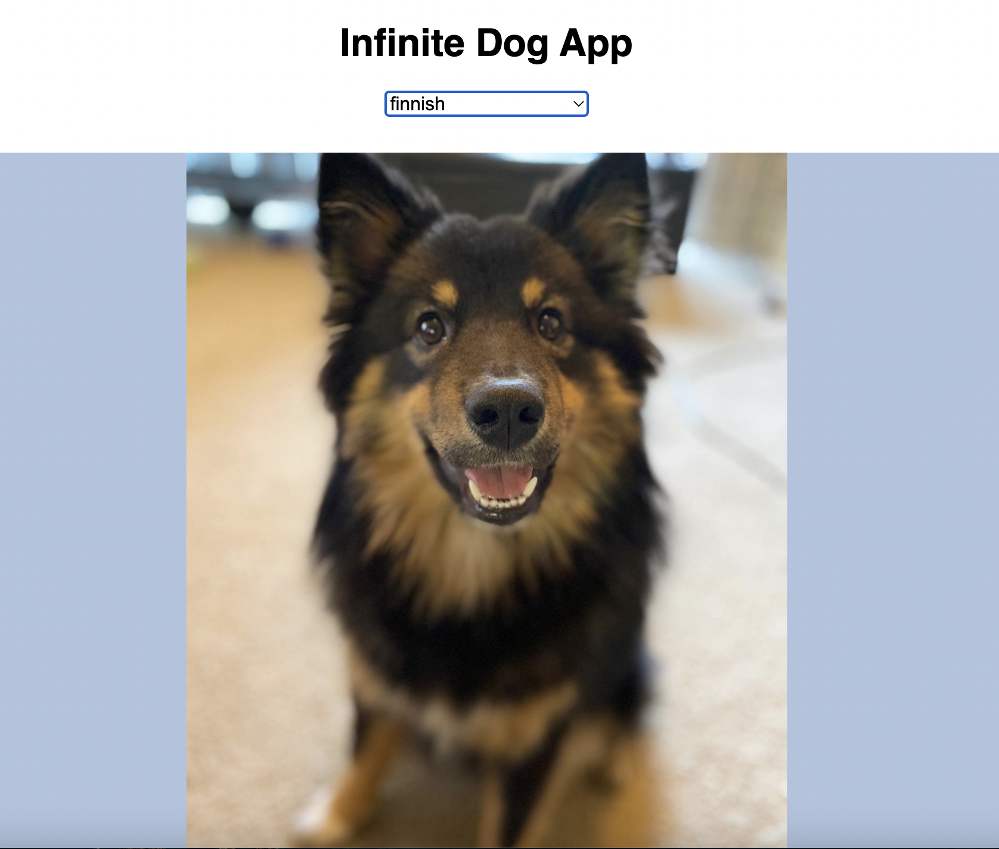
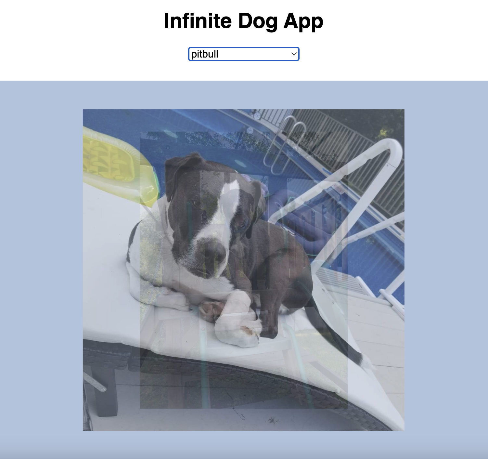

# 🐶 Dogs Display Website (usingAPI)
&nbsp;&nbsp;&nbsp;&nbsp; It is a website that displays photos of a breed of dog of your choosing. The list of breeds are available as a drop-down menu and any one breed can be chosen. The website subsequently displays different photos of the chosen/particular breed of dog in a slideshow manner.

## About Infinite Dog Website
The website provides a fun way to display pics of DOGS! 
- displays website title  
- offers a dropdown menu  
- display a variety of photos of a chosen dog breed on a light blue background

## Deployment

Check out the **Infinite Dog App** website here --> Demo: [Dogs Display WebSite](https://rahuls1428.github.io/Dogs-Display-usingAPI)

## Tools Used

This website uses basic HTML5 and CSS3 along with JavaScript that uses an API. An API is simply a medium to fetch or send data between interfaces. Let’s say you want to make an application that provides the user with some real-time data fetched from a server or maybe even allows you to modify or add data to some other endpoint. This is made possible by the API or the Application Programming Interface. In this project we use concepts of:
1. a simple public API that requires no authentication and allows you to fetch some data by querying the API with GET requests.
2. fetch() function - which is method in JavaScript and is used to request to the server and load the information on the webpages. The request can be of any APIs that return the data of the format JSON or XML. This method returns a promise. To learn more click [here](https://www.javascripttutorial.net/javascript-fetch-api/).
3. async function is a function declared with the async keyword and the await keyword is permitted within it. The async and await keywords enable asynchronous, promise-based behavior to be written in a cleaner style, avoiding the need to explicitly configure promise chains.
3. use try and catch in case a problem occurs during an API call. The try statement allows you to define a block of code to be tested for errors while it is being executed. The catch statement allows you to define a block of code to be executed, if an error occurs in the try block.
4. setInterval and setTimeout methods. The setInterval() method repeats a block of code at every given timing event. We can use the clearInterval() method to stop the execution of the function specified in setInterval() method. The setTimeout() method calls a function after a number of milliseconds.
5. CSS was used to create the slideshow effect using: 'transform' and 'transition' properties

The code also uses: .map() function which is a method that creates a new array populated with the results of calling a provided function on every element in the calling array, AND template literals for writing multi-line HTML codes

## Authors

  * **Rahul Solaiappan**

## Acknowledgement
The website was developed with help from LearnWebDev's YouTube video: Dogs, JavaScript & An API.

